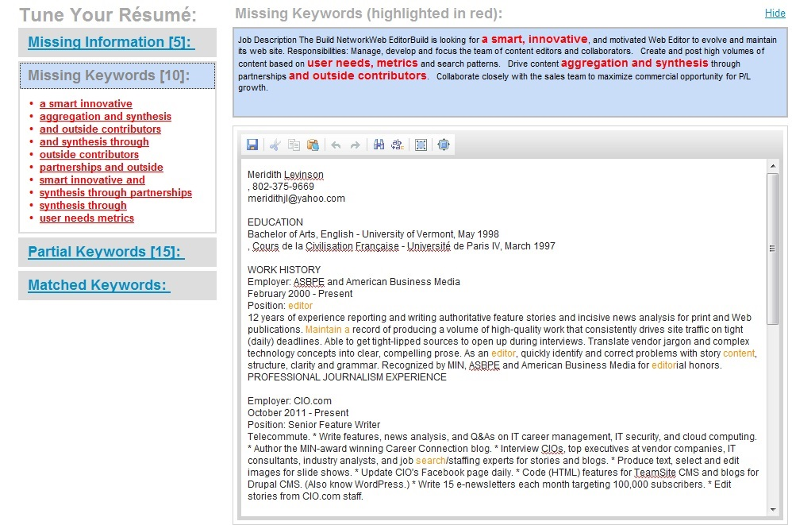

## applicant tracking systems

* articles read:
  * https://www.cio.com/article/2398753/careers-staffing/careers-staffing-5-insider-secrets-for-beating-applicant-tracking-systems.html
  * http://recruitingdaily.com/top-applicant-tracking-systems-2017/
* takeaways:
  * what matters most to applicant tracking systems is the uniqueness or "rarity" of the keyword or the keyword phrase. That is, the keywords and phrases must be specific to a particular job ad.
  * ATS interface:
  

* optimizing resume for ATS:
  1. Never send your resume as a PDF: Because applicant tracking systems lack a standard way to structure PDF documents, they're easily misread.

  2. Don't include tables or graphics: Applicant tracking systems can't read graphics, and they misread tables. Instead of reading tables left to right, as a person would, applicant tracking systems read them up and down.

  3. Submit a longer resume.

  4. Call your work experience, "Work Experience".

  5. Don't start your work experience with dates: To ensure applicant tracking systems read and import your work experience properly, always start it with your employer's name, followed by your title, followed by the dates you held that title. (Each can run on its own line). Applicant tracking systems look for company names first.
